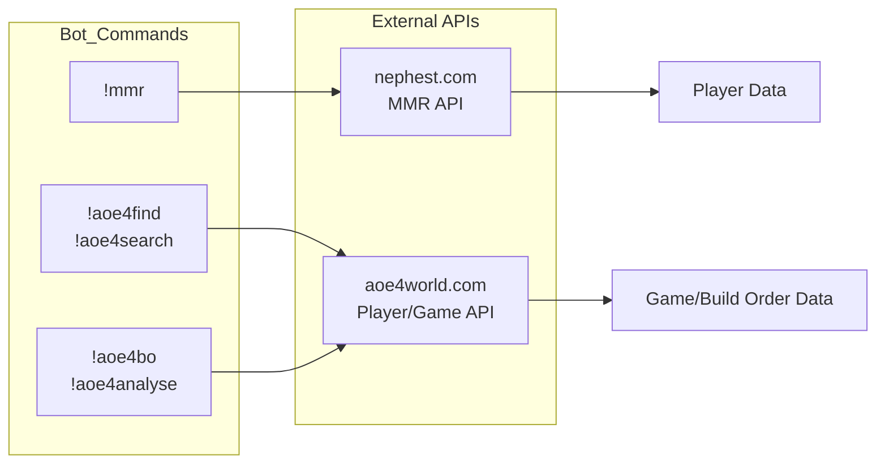
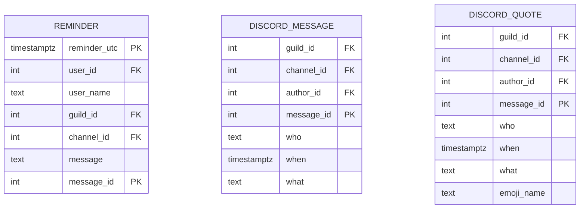
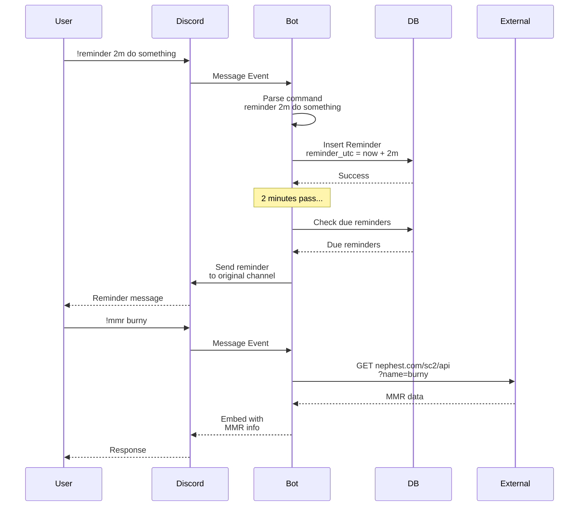

# Python Discord Sc2 Bot

### Installation
- Install python 3.8 or newer (32 or 64 bit)
- Run commands
    ```
    pip install uv --user
    uv sync
    ```
- Required private file: DISCORDKEY, SUPABASEKEY, SUPABASEURL (the error messages should display if certain keys are missing)

### Development
Open this project folder `discord_bot` with VSCode via command `code discord_bot`. Configure the python interpreter to point to your venv location. Now the debugger options from the project's launch.json and the `testing` tab should be available in VSCode. Consider installing the recommended VSCode extensions.

You can run and debug the bot and tests via the debug config, or manually via terminal `uv run python main.py` and the tests via `uv run python -m pytest`

### Running

Start the bot in `cwd=discord_bot/` with command

`uv run python main.py`

or inside docker via

`sh run.sh`

### Commands
**Public commands:**
```markdown
# Uses nephest.com to grab mmr of the player
!mmr <sc2-name>

# Remind the user in a certain time in the same channel of a text message
!reminder <time-offset> <message>
!reminder 2m this will remind me in 2 minutes
!reminder 2h this will remind me in 2 hours
!reminder 2h 2m this will remind me in 2 hours and 2 minutes

# Remind the user at a certain time in the same channel of a text message
!remindat <date> <time> <message>
!remindat <date> <message>
!remindat <time> <message>
!remindat 16:20 this will remind me at 16:20 utc
!remindat 4-20 this will remind me on 20th of april at midnight utc
!remindat 4-20 16:20 this will remind me on 20th of april at 16:20 utc

# List all your pending reminders
!reminders

# Remove a reminder from !reminders
!delreminder <reminder-id>

# Count all the emotes of the user on that server
!count

# Display leaderboard of users in this server
!leaderboard
!leaderboard -m
!leaderboard -w
!leaderboard 5-15
!leaderboard -m 5-15
!leaderboard 5-15 -m

# Display a random TWSS quote
!twss

# Find specific aoe4 player profiles with a given name
!aoe4find burny
!aoe4search burny

# Analyse build order of a specific game from a specific player perspective
!aoe4analyse https://aoe4world.com/players/585764/games/66434421
!aoe4analyse <https://aoe4world.com/players/585764/games/66434421>

# Find games that match the specific criteria
!aoe4bo --race english --condition 2towncenter<400s,wheelbarrow<900s,feudal<360s,castle<660s
```

---

## Architecture

```mermaid
flowchart TD
    Start[Bot Starts] --> on_start[on_start Event]
    on_start --> loop_function[Background Loop<br/>Checks Reminders Every Second]
    on_start --> get_all_servers[Fetch All Servers]

    subgraph handle_new_message[Message Event Handler]
        MSG[New Message] --> CHECK{Is Human<br/>& Has Content?}
        CHECK -->|No| SKIP[Ignore]
        CHECK -->|Yes| PREFIX{Starts with<br/>'!'?}
        PREFIX -->|No| SKIP2[Ignore]
        PREFIX -->|Yes| handle_commands[Parse Command]
    end

    subgraph Commands
        handle_commands --> CMD{Command Type}
        CMD -->|reminder| Remind[Remind Class]
        CMD -->|mmr| MMR[public_mmr]
        CMD -->|leaderboard| LB[public_leaderboard]
        CMD -->|twss| TWSS[public_twss]
        CMD -->|aoe4*| AOE4[AoE4 Commands]
    end

    subgraph Database[(PostgreSQL)]
        Reminder[(Reminder)]
        DiscordMessage[(DiscordMessage)]
        DiscordQuote[(DiscordQuote)]
    end

    Remind --> Database
    MMR --> Database
    TWSS --> Database
    get_all_servers --> insert_task[Async Insert<br/>Messages to DB]
    insert_task --> DiscordMessage
```






