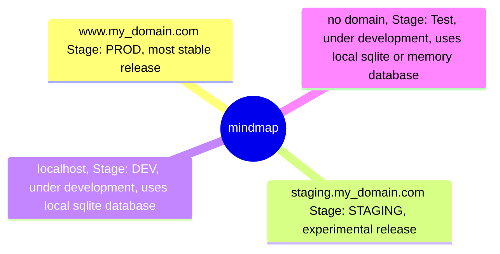

# Fastapi sqlmodel webserver

## Requirements

- Python >=3.8.1 <3.13 with `poetry` installed
- Docker with docker compose installed

## Launch local dev server

Start database (postgres) and minio
```
docker compose --profile dev up
```

Go to http://minioadmin.localhost with login 'root' password 'rootroot and set up api key and add the credentials to the .env file.

Install dependencies with `poetry install`

Start webserver with `poetry run python app.py` or via the vscode debug config `Start LiteStar`.

Now you can go to http://0.0.0.0:8000 or http://0.0.0.0:8000/schema to check out the documentation to all endpoints.

Under http://pgadmin.localhost you can `register` the postgres instance with host name `fastapi_dev_postgres`, port `5432`, username `root` and password `root` and keep database as `postgres` and now click on `save`. You will now be able to browse the database tables and data.

# Ideal structure of the project


# Create postgres user and permissions to create tables

```sql
-- Create user
CREATE USER litestar_server_dev WITH PASSWORD 'your_password';
-- Allow user to create tables
GRANT CREATE ON SCHEMA public TO litestar_server_dev;
```
