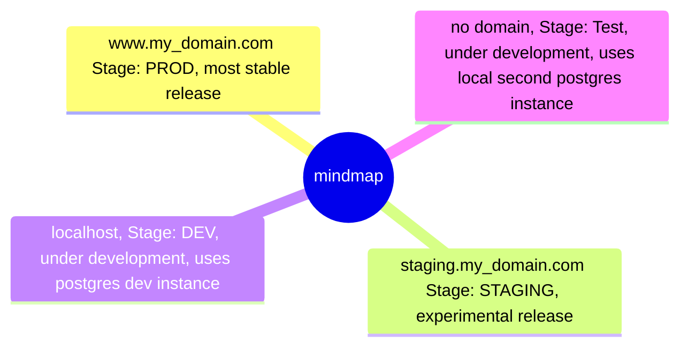
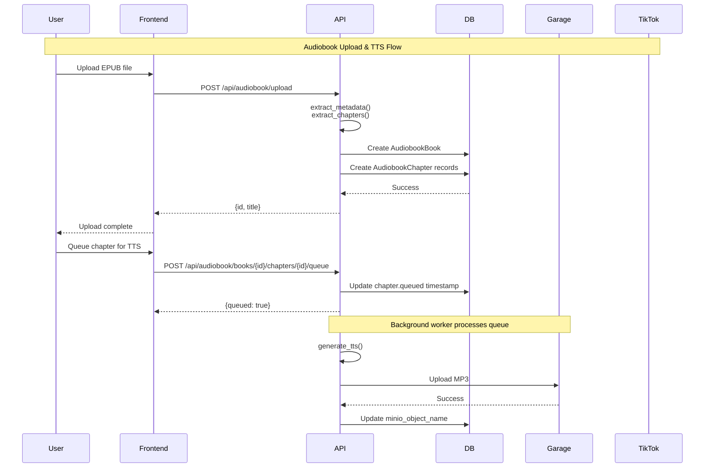
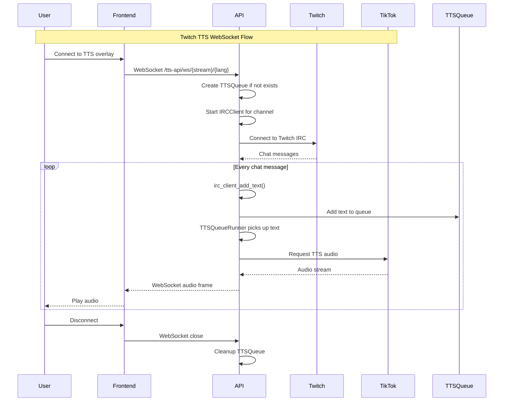
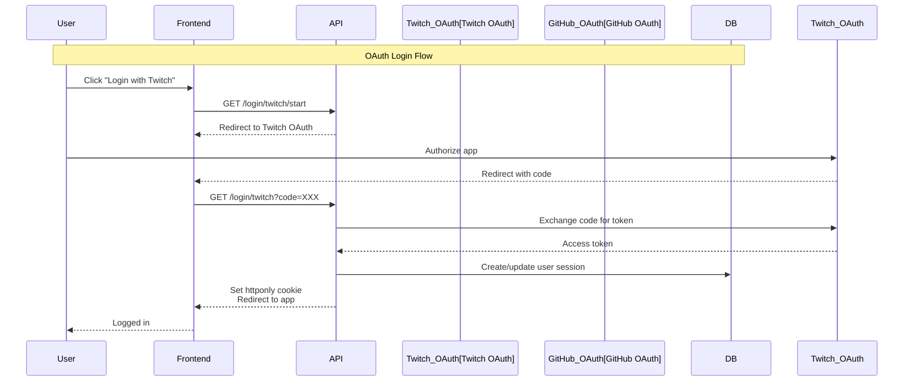
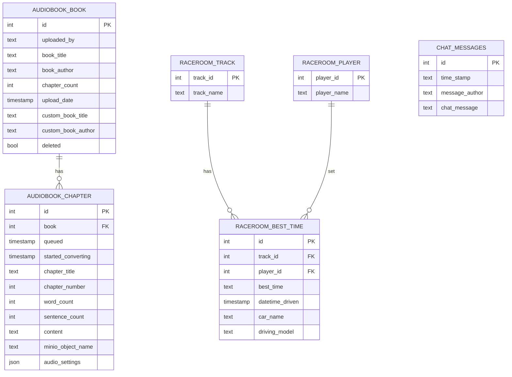
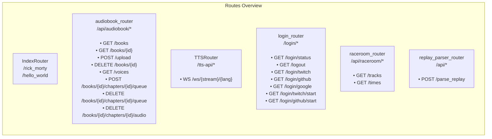

# Fastapi sqlmodel webserver

## Requirements

- Python >=3.8.1 <3.13 with `uv` installed
- Docker with docker compose installed

## Launch local dev server

Start database (postgres) and rustfs
```
docker compose up
```

Install dependencies with
```sh
uv sync
```

Open a Python file in the `fastapi_server` folder and select the correct python environment in the bottom right of vscode.

Start webserver with `uv run src/app.py` or via the vscode debug config `Start LiteStar`.

Now you can go to http://0.0.0.0:8000 or http://0.0.0.0:8000/schema to check out the documentation to all endpoints.

Under http://pgadmin.localhost you can `register` the postgres instance with host name `fastapi_dev_postgres`, port `5432`, username `root` and password `root` and keep database as `postgres` and now click on `save`. You will now be able to browse the database tables and data.

# Fastapi allowed response types
Pydantic
```py
from pydantic import BaseModel

class Item(BaseModel):
    name: str
    price: float
    is_offer: bool | None = None

@app.get("/items/{item_id}", response_model=Item)
async def get_item(item_id: int):
    return {"name": "Widget", "price": 19.99}

@app.get("/items", response_model=list[Item])
async def get_items():
    return [
        {"name": "Foo", "price": 50.2},
        {"name": "Bar", "price": 62.0}
    ]
```

Response type vs response model
```py
# Both approaches work identically for documentation
@app.get("/items/{item_id}", response_model=Item)
async def get_item(item_id: int) -> Item:
    return Item(name="Foo", price=50.2)

@app.get("/items/{item_id}")
async def get_item(item_id: int) -> Item:
    return {"name": "Foo", "price": 50.2}
```

# Ideal structure of the project

```mermaid
---
title: "Stages: local_dev, dev, staging, prod, test"
---
mindmap
  root((mindmap))
    www.my_domain.com Stage: PROD, most stable release
    staging.my_domain.com Stage: STAGING, experimental release
    localhost, Stage: DEV, under development, uses postgres dev instance
    no domain, Stage: Test, under development, uses local second postgres instance
```

---

## API Architecture

```mermaid
flowchart TB
    subgraph Frontend["Frontend (Svelte)"]
        Svelte_UI[SvelteKit Apps]
    end

    subgraph FastAPI["FastAPI Server"]
        API[Main API]

        subgraph Routers
            Index[IndexRouter<br/>/rick_morty<br/>/hello_world]
            Audiobook[audiobook_router<br/>/api/audiobook/*]
            TTS[TTSRouter<br/>/tts-api/ws/*]
            Login[login_router<br/>/login/*]
            Raceroom[raceroom_router<br/>/api/raceroom/*]
            Replay[replay_parser_router<br/>/api/parse_replay]
        end

        API --> Routers
    end

    subgraph External_Services["External Services"]
        Twitch_IRC[Twitch IRC]
        Garage_S3[(Garage S3)]
        Twitch_API[Twitch API]
        TikTok_TTS[TikTok TTS API]
    end

    subgraph Database[(PostgreSQL)]
        Audiobook_DB[Audiobook Tables]
        Chat_DB[Chat Messages]
        Raceroom_DB[Raceroom Tables]
    end

    Svelte_UI <--> API
    Svelte_UI <--> Login

    Audiobook --> Database
    Audiobook --> Garage_S3

    TTS --> Twitch_IRC
    TTS --> TikTok_TTS
    TTS --> Svelte_UI
```


```mermaid
sequenceDiagram
    participant User
    participant Frontend
    participant API
    participant DB
    participant Garage

    Note over User,TikTok: Audiobook Upload & TTS Flow

    User->>Frontend: Upload EPUB file
    Frontend->>API: POST /api/audiobook/upload
    API->>API: extract_metadata()<br/>extract_chapters()
    API->>DB: Create AudiobookBook
    API->>DB: Create AudiobookChapter records
    DB-->>API: Success
    API-->>Frontend: {id, title}
    Frontend-->>User: Upload complete

    User->>Frontend: Queue chapter for TTS
    Frontend->>API: POST /api/audiobook/books/{id}/chapters/{id}/queue
    API->>DB: Update chapter.queued timestamp
    API-->>Frontend: {queued: true}

    Note over API,Garage: Background worker processes queue

    API->>API: generate_tts()
    API->>Garage: Upload MP3
    Garage-->>API: Success
    API->>DB: Update minio_object_name
```


```mermaid
sequenceDiagram
    participant User
    participant Frontend
    participant API
    participant Twitch
    participant TikTok

    Note over User,TikTok: Twitch TTS WebSocket Flow

    User->>Frontend: Connect to TTS overlay
    Frontend->>API: WebSocket /tts-api/ws/{stream}/{lang}
    API->>API: Create TTSQueue if not exists
    API->>API: Start IRCClient for channel

    API->>Twitch: Connect to Twitch IRC
    Twitch-->>API: Chat messages

    loop Every chat message
        API->>API: irc_client_add_text()
        API->>TTSQueue: Add text to queue
        API->>API: TTSQueueRunner picks up text
        API->>TikTok: Request TTS audio
        TikTok-->>API: Audio stream
        API-->>Frontend: WebSocket audio frame
        Frontend-->>User: Play audio
    end

    User->>Frontend: Disconnect
    Frontend->>API: WebSocket close
    API->>API: Cleanup TTSQueue
```


```mermaid
sequenceDiagram
    participant User
    participant Frontend
    participant API
    participant Twitch_OAuth[Twitch OAuth]
    participant GitHub_OAuth[GitHub OAuth]
    participant DB

    Note over User,DB: OAuth Login Flow

    User->>Frontend: Click "Login with Twitch"
    Frontend->>API: GET /login/twitch/start
    API-->>Frontend: Redirect to Twitch OAuth

    User->>Twitch_OAuth: Authorize app
    Twitch_OAuth-->>Frontend: Redirect with code

    Frontend->>API: GET /login/twitch?code=XXX
    API->>Twitch_OAuth: Exchange code for token
    Twitch_OAuth-->>API: Access token
    API->>DB: Create/update user session
    API-->>Frontend: Set httponly cookie<br/>Redirect to app
    Frontend-->>User: Logged in
```


```mermaid
erDiagram
    AUDIOBOOK_BOOK {
        int id PK
        text uploaded_by
        text book_title
        text book_author
        int chapter_count
        timestamp upload_date
        text custom_book_title
        text custom_book_author
        bool deleted
    }

    AUDIOBOOK_CHAPTER {
        int id PK
        int book FK
        timestamp queued
        timestamp started_converting
        text chapter_title
        int chapter_number
        int word_count
        int sentence_count
        text content
        text minio_object_name
        json audio_settings
    }

    RACEROOM_TRACK {
        int track_id PK
        text track_name
    }

    RACEROOM_PLAYER {
        int player_id PK
        text player_name
    }

    RACEROOM_BEST_TIME {
        int id PK
        int track_id FK
        int player_id FK
        text best_time
        timestamp datetime_driven
        text car_name
        text driving_model
    }

    CHAT_MESSAGES {
        int id PK
        text time_stamp
        text message_author
        text chat_message
    }

    AUDIOBOOK_BOOK ||--o{ AUDIOBOOK_CHAPTER : has
    RACEROOM_TRACK ||--o{ RACEROOM_BEST_TIME : "has"
    RACEROOM_PLAYER ||--o{ RACEROOM_BEST_TIME : "set"
```


```mermaid
flowchart LR
    subgraph Routes["Routes Overview"]
        direction TB
        index["IndexRouter<br/>/rick_morty<br/>/hello_world"]
        audiobook["audiobook_router<br/>/api/audiobook/*<br/><br/>• GET /books<br/>• GET /books/{id}<br/>• POST /upload<br/>• DELETE /books/{id}<br/>• GET /voices<br/>• POST /books/{id}/chapters/{id}/queue<br/>• DELETE /books/{id}/chapters/{id}/queue<br/>• DELETE /books/{id}/chapters/{id}/audio"]
        tts["TTSRouter<br/>/tts-api/*<br/><br/>• WS /ws/{stream}/{lang}"]
        login["login_router<br/>/login/*<br/><br/>• GET /login/status<br/>• GET /logout<br/>• GET /login/twitch<br/>• GET /login/github<br/>• GET /login/google<br/>• GET /login/twitch/start<br/>• GET /login/github/start"]
        raceroom["raceroom_router<br/>/api/raceroom/*<br/><br/>• GET /tracks<br/>• GET /times"]
        replay["replay_parser_router<br/>/api/*<br/><br/>• POST /parse_replay"]
    end
```
