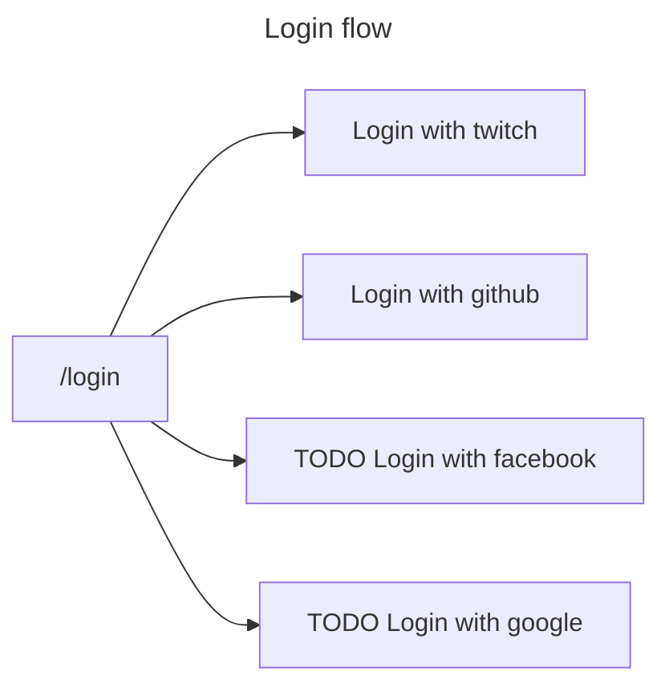

## Login

```mermaid
---
title: Login flow
---
graph LR;
    A["/"login]-->B[Login with twitch];
    A-->C[Login with github];
    A-->D[TODO Login with facebook];
    A-->E[TODO Login with google];
```
