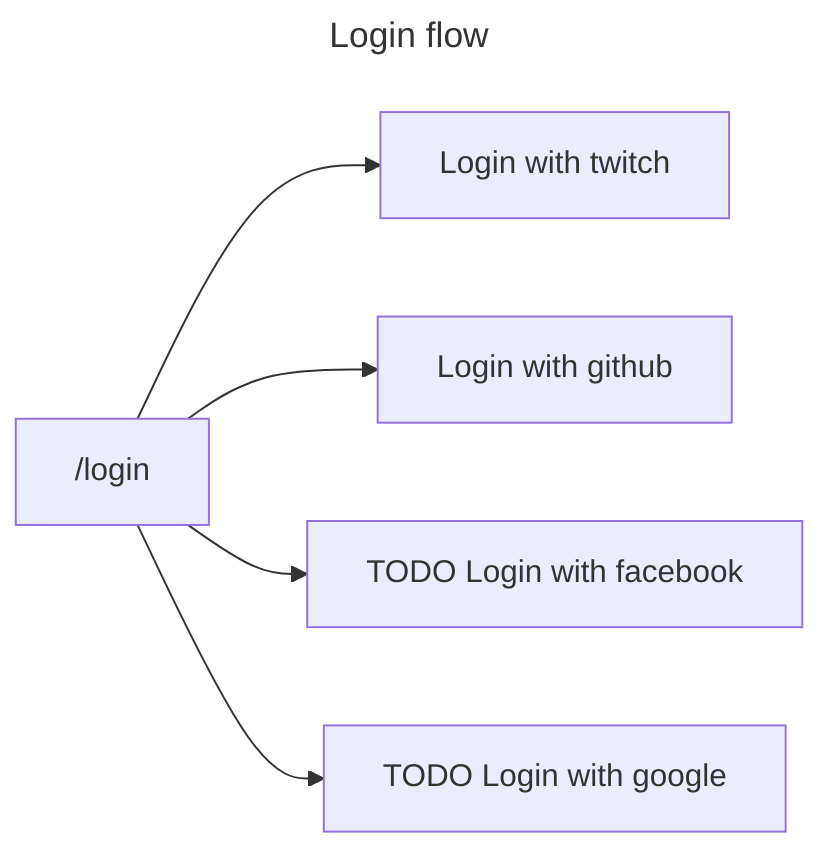
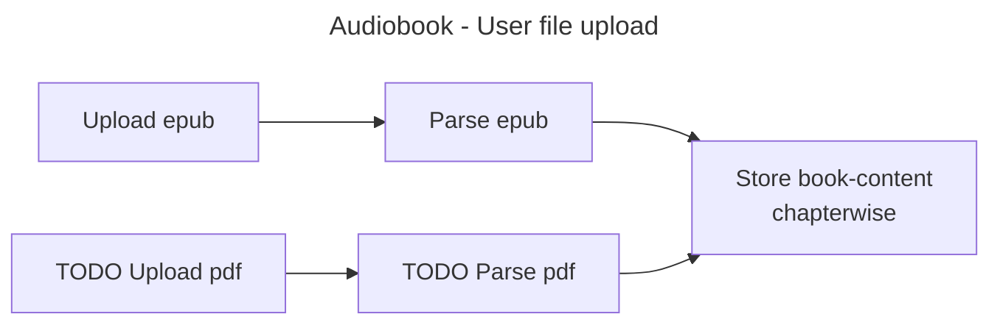
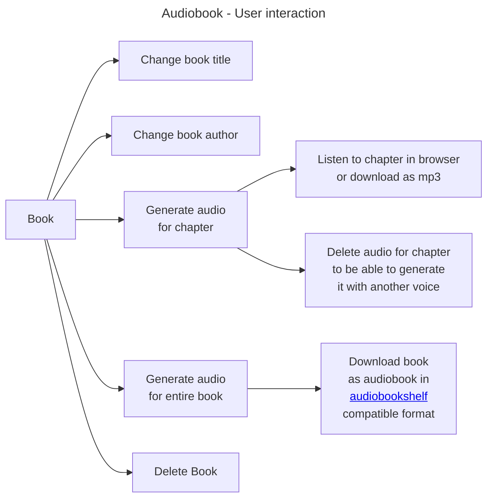

## Login

```mermaid
---
title: Login flow
---
graph LR;
    A["/"login]-->B[Login with twitch];
    A-->C[Login with github];
    A-->D[TODO Login with facebook];
    A-->E[TODO Login with google];
```

## Audiobook

```mermaid
---
title: Audiobook - User file upload
---
graph LR;
    A[Upload epub]-->B[Parse epub];
    B-->C[Store book-content \n chapterwise];
    D[TODO Upload pdf]-->E[TODO Parse pdf];
    E-->C;
```

```mermaid
---
title: Audiobook - User interaction
---
graph LR;
    A[Book]-->B[Change book title];
    A-->C[Change book author];
    A-->D[Generate audio \n for chapter];
    A-->E[Generate audio \n for entire book];
    D-->F[Listen to chapter in browser \n or download as mp3];
    E-->G[Download book \n as audiobook in \n <a href="https://www.audiobookshelf.org">audiobookshelf</a> \n compatible format]
    A-->H[Delete Book]
    D-->I[Delete audio for chapter \n to be able to generate \n it with another voice]
```
