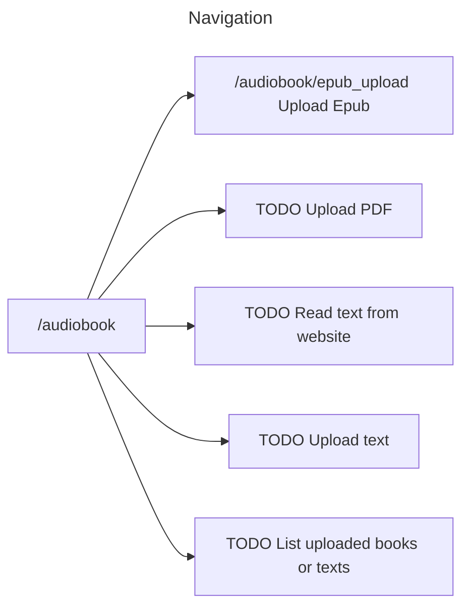
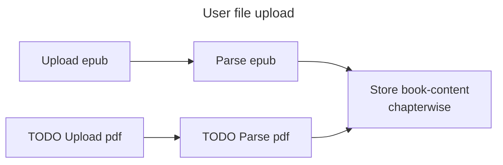
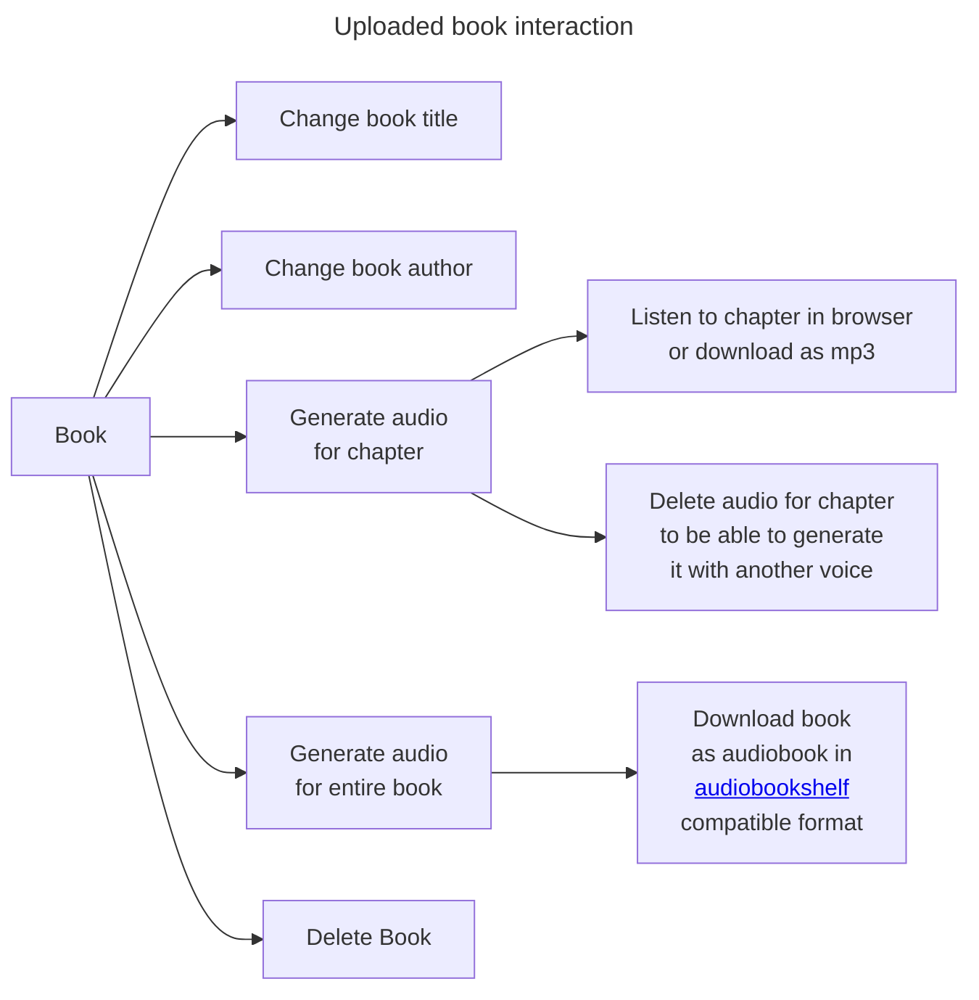

## Audiobook

```mermaid
---
title: Navigation
---
graph LR;
    A["/audiobook"]-->B["/audiobook/epub_upload" Upload Epub];
    A["/audiobook"]-->C[TODO Upload PDF];
    A["/audiobook"]-->D[TODO Read text from website];
    A["/audiobook"]-->E[TODO Upload text];
    A["/audiobook"]-->F[TODO List uploaded books or texts];
```

```mermaid
---
title: User file upload
---
graph LR;
    A[Upload epub]-->B[Parse epub];
    B-->C[Store book-content \n chapterwise];
    D[TODO Upload pdf]-->E[TODO Parse pdf];
    E-->C;
```

```mermaid
---
title: Uploaded book interaction
---
graph LR;
    A[Book]-->B[Change book title];
    A-->C[Change book author];
    A-->D[Generate audio \n for chapter];
    A-->E[Generate audio \n for entire book];
    D-->F[Listen to chapter in browser \n or download as mp3];
    E-->G[Download book \n as audiobook in \n <a href="https://www.audiobookshelf.org">audiobookshelf</a> \n compatible format]
    A-->H[Delete Book]
    D-->I[Delete audio for chapter \n to be able to generate \n it with another voice]
```
