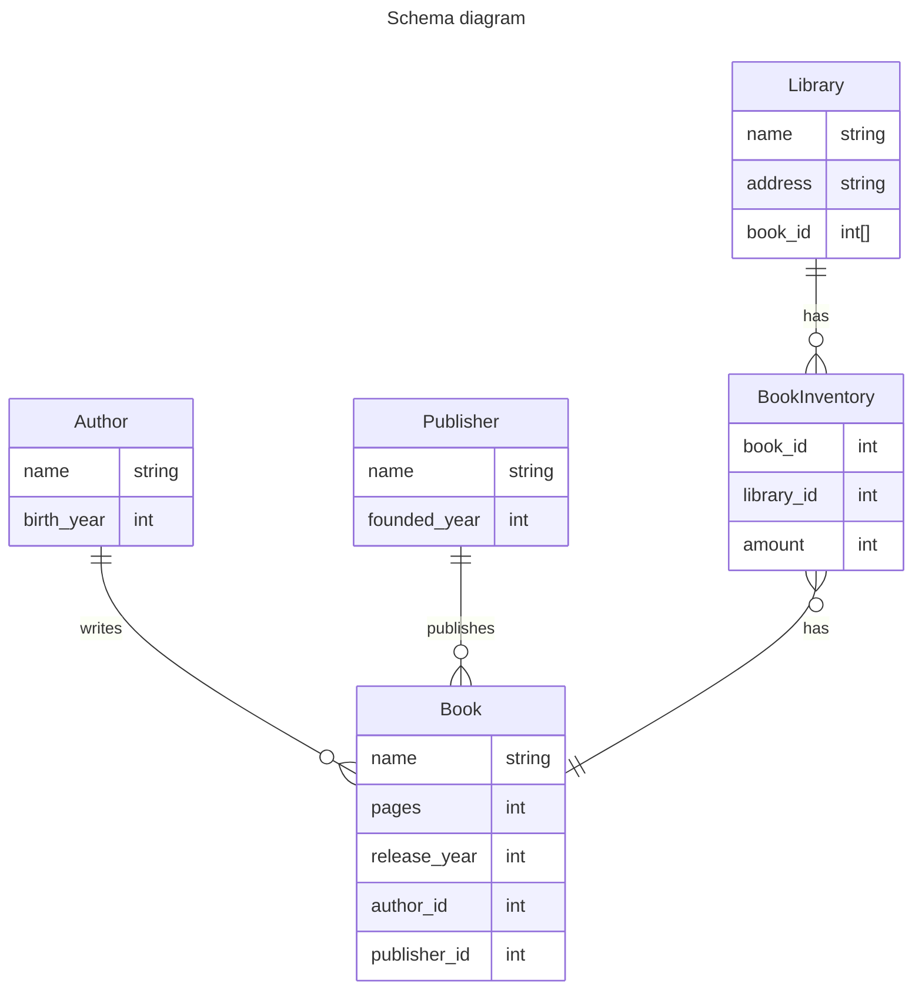

# Database examples 

## Tables
### Library
- id
- name: str
- address: str
- books: List[BookInventory]

### BookInventory
- id
- book: Book
- library: Library
- amount: int

### Book
- id
- name: str
- pages: int
- release_year: int
- author: Author
- publisher: Publisher

### Author
- id
- name: str
- birth_year: int

### Publisher
- id
- name: str
- founded_year: int

## Schema diagram

## Query example
Each database example should have these actions as examples:

1) Create tables
2) Add new items
3) Query (select), with filters
4) Update items
5) Delete items
6) Join multiple tables
7) Join two tables and apply filter to both
8) Apply migrations (modify a table with existing data)
9) Clear table (remove all items)
