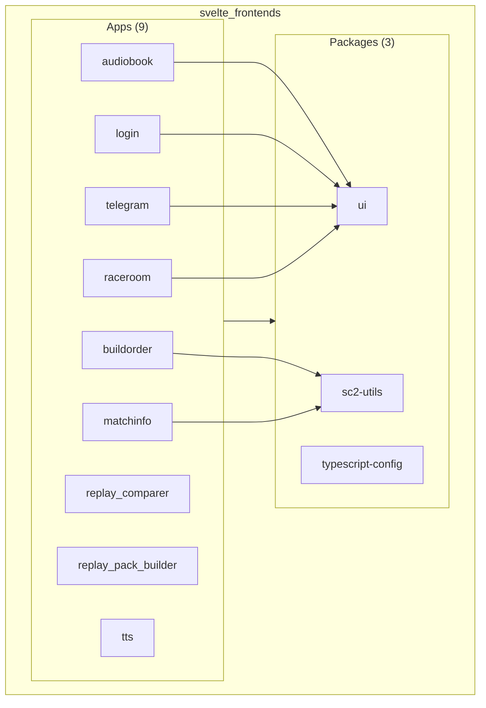
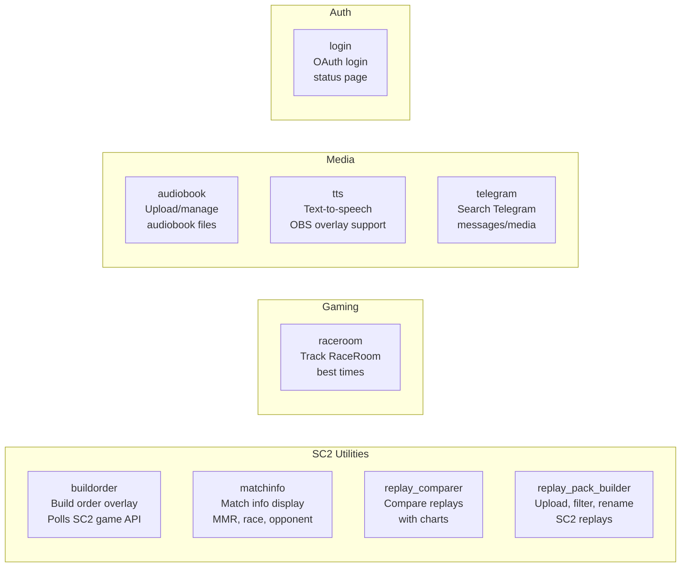
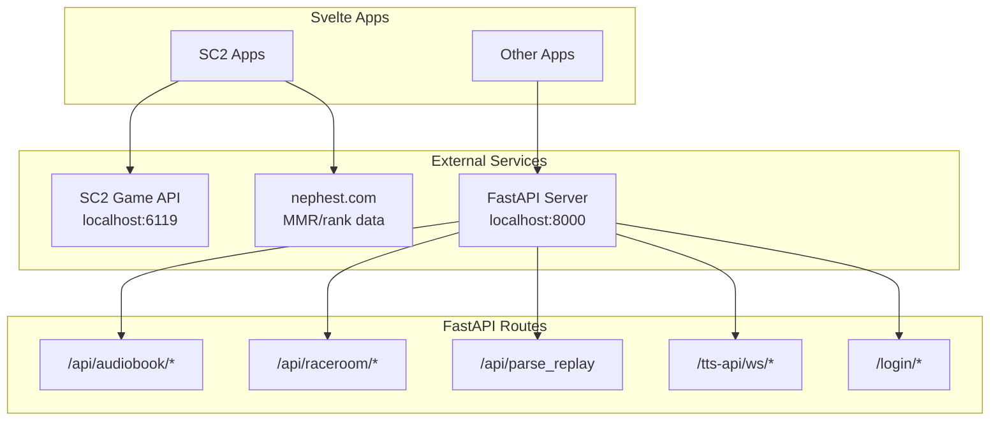
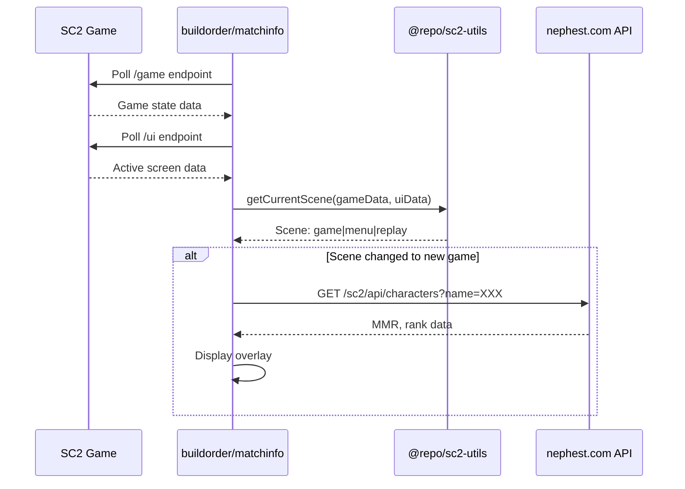
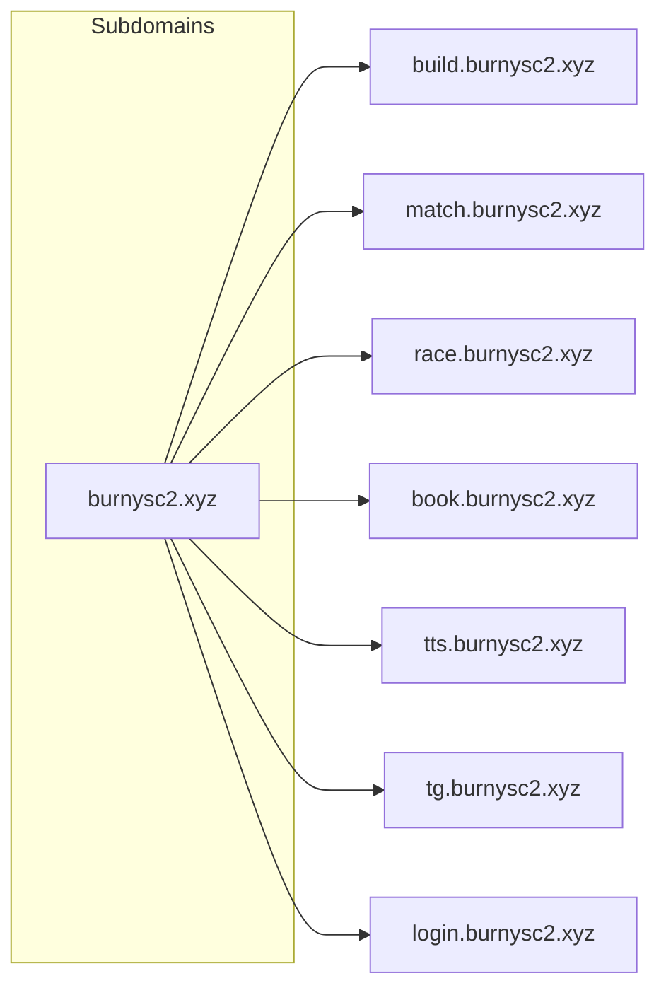

# Turborepo Svelte Monorepo

A monorepo containing multiple Svelte 5/SvelteKit frontend applications for StarCraft 2 utilities and other projects.

## Project Structure



## Apps Overview



## External API Connections



## SC2 App Integration Flow



## Deployment / Subdomain Mapping



## Tech Stack

- **Framework**: Svelte 5 / SvelteKit 2
- **Build Tool**: Turborepo 2
- **Language**: TypeScript 5.9
- **Linting**: Biome
- **Testing**: Vitest, Playwright

## Commands

```sh
# Development
npm run dev              # Run all apps in dev mode
npm run build            # Build all apps
npm run check            # Type-check all apps
npm run lint             # Lint all apps
npm run lint:fix         # Fix lint issues

# Testing
npm run test             # Run all tests
npm run test:unit        # Unit tests only
npm run test:integration # Integration tests only
```
