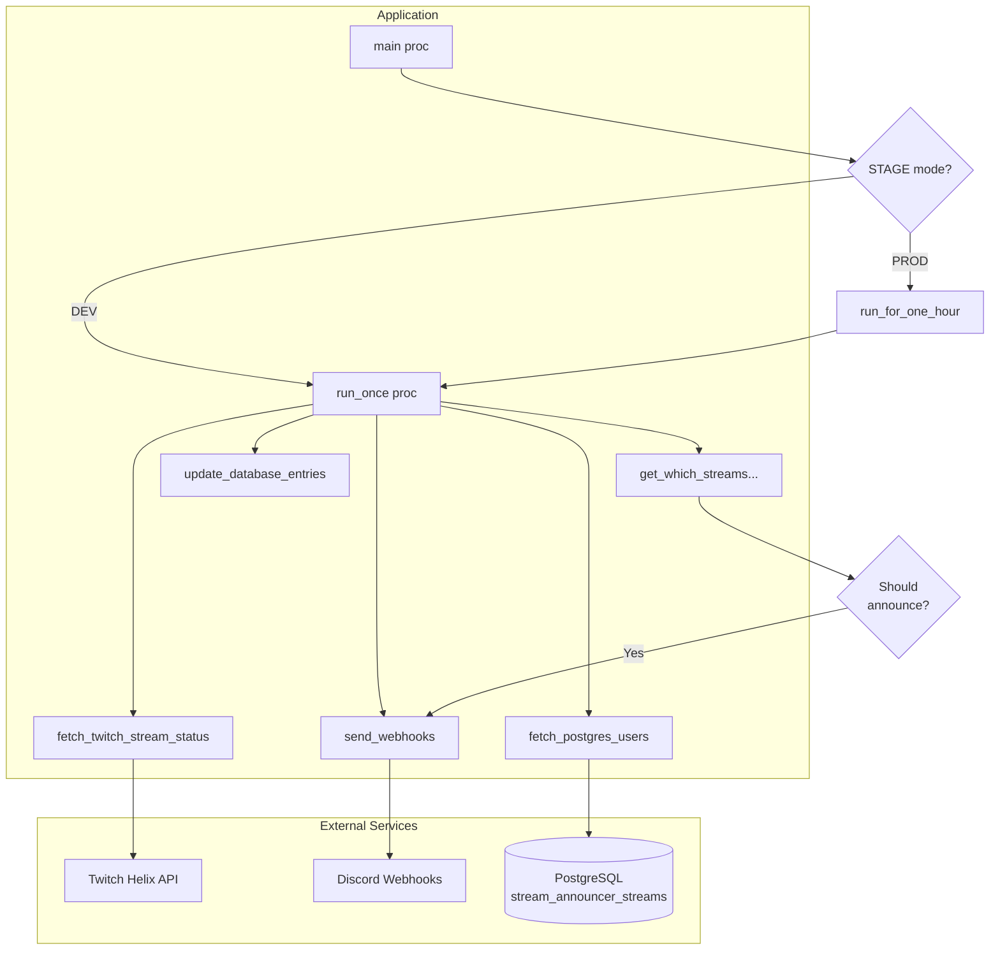
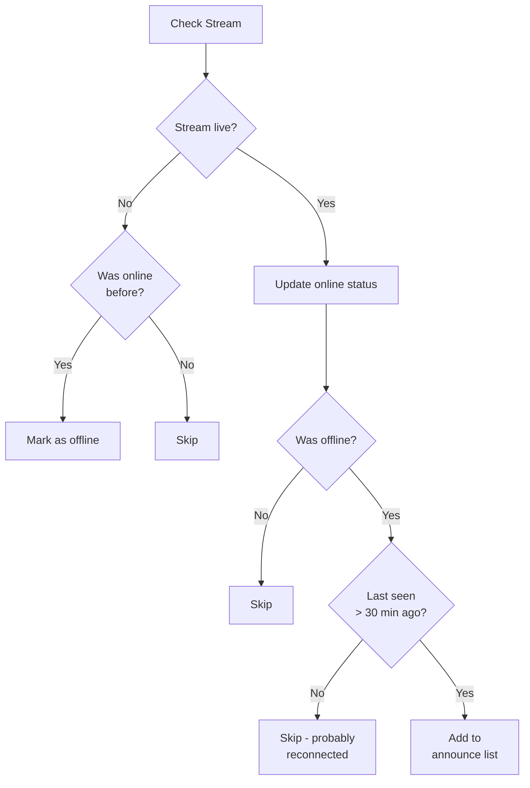
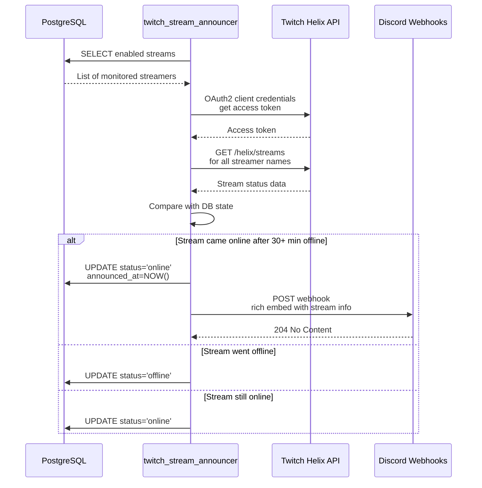
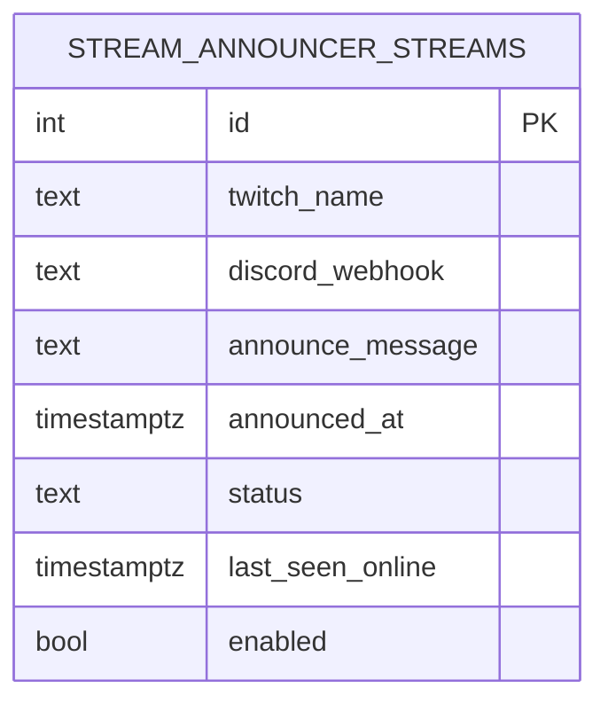

# Compile with nimble

```sh
# Compile in fastest mode
nimble c -d:ssl -d:release -o:main src/main.nim
# nimble c -d:ssl -d:danger -o:main src/main.nim
# Run
./main
```

# Build slim image

https://github.com/slimtoolkit/slim

```sh
docker build -t burnysc2/twitch_stream_announcer:local .
slim build --target burnysc2/twitch_stream_announcer:local --tag burnysc2/twitch_stream_announcer:latest--http-probe=false --env STAGE=BUILD --exec "/root/tsa/main"
# 'docker images' should print image smaller than 8mb
```

# Create postgres user and permission

```sql
-- Create user
CREATE USER twitch_stream_announcer WITH PASSWORD 'your_password';
-- Add select permission
GRANT SELECT ON stream_announcer_streams TO twitch_stream_announcer;
--Add update permission to columns status and announced_at
GRANT UPDATE(status, announced_at) ON stream_announcer_streams TO twitch_stream_announcer;
```

---

## Architecture








